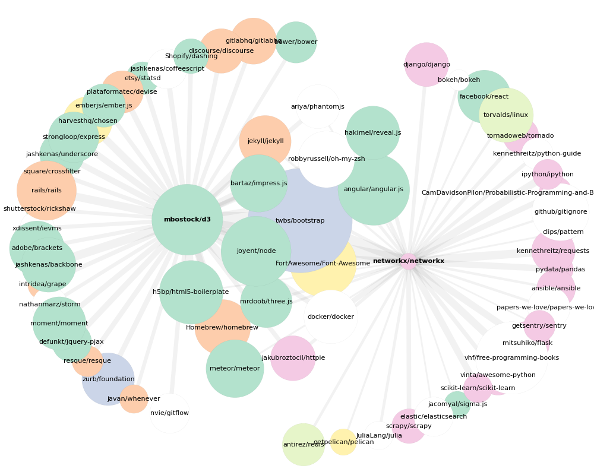

Script to create a visualisation for a graph of Github repositories.

For a set of root repositories, the script discovers other associated 
projects by looking at each user who has starred the repo and then 
loading all other repos that user also starred. The resulting graph
is weighted by the number of starring users in common.

NetworkX is used to create both a static image and an interative
version with D3.

## To Run

```sh
python github-graph.py --github-token xxx --plot-file testrepo.png --json-file testrepo.json github/testrepo
display testrepo.png

python -m SimpleHTTPServer &
open 'http://localhost:8000/index.html?d=testrepo.json'
```


## Output

Example for [NetworkX](https://github.com/networkx/networkx) & [D3](https://github.com/mbostock/d3):



Try the interactive version at [index.html](http://rawgit.com/paulegan/github-graph/master/index.html?d=examples/networkx.json).
